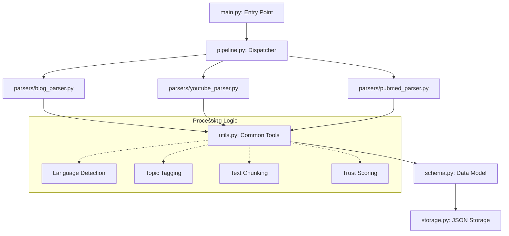

# 🕷️ Scraper Engine: Multi-Source Data Harvester


A robust, multi-ecosystem scraping engine designed to extract, clean, and normalize content from disparate sources into a strictly typed JSON schema. Targeted towards **Blogs**, **YouTube**, and **PubMed**.

## 🚀 Overview

The Scraper Engine is a modular Python system that utilizes specialized parsers for different content types. It handles boilerplate removal, automatic topic tagging, language detection, and content chunking to provide high-fidelity data for downstream processing (e.g., LLM fine-tuning, RAG pipelines, or research analysis).

## ✨ Key Features

- **Multi-Source Support**:
  - 📝 **Blogs**: High-fidelity text extraction using Newspaper3k with Readability-lxml fallback.
  - 🎥 **YouTube**: Metadata and transcript extraction via `yt-dlp` and `youtube-transcript-api`.
  - 🔬 **PubMed**: Scientific literature metadata and abstract extraction via Biopython (Entrez).
- **Intelligent Processing**:
  - **Deduplication**: Prevents duplicate entries based on Source URL.
  - **Topic Tagging**: Automatic extraction of key phrases using RAKE-NLTK.
  - **Content Chunking**: Segmenting long-form text into logical segments.
  - **Schema Validation**: 100% adherence to strict Pydantic schemas.
- **Resilience**:
  - **Anti-Scraping**: Header rotation with randomized User-Agents.
  - **Rate Limiting**: Configurable sleep intervals to respect source policies.
  - **Graceful Failures**: Error isolation per source ensures the pipeline continues even if one target fails.

## 🏗️ Architecture



## 🛠️ Installation

1. **Clone the repository**:
   ```cmd
   cd "C:\Users\shaur\OneDrive\Desktop\Scrapper"
   ```

2. **Install Dependencies**:
   ```cmd
   pip install -r requirements.txt
   ```

## ⚡ Usage

Run the scraper using the main entry point:

```cmd
python main.py
```

Or use the provided one-click batch script on Windows:
```cmd
run.bat
```

## 📊 Data Schema

All extracted data follows this canonical structure:

| Field | Type | Description |
|---|---|---|
| `source_url` | `string` | The canonical URL or reference ID. |
| `source_type` | `enum` | one of `blog`, `youtube`, `pubmed`. |
| `author` | `string` | Author name or Channel title. |
| `published_date`| `string` | ISO-8601 formatted date. |
| `language` | `string` | ISO 639-1 language code. |
| `topic_tags` | `array` | Extracted topic keywords. |
| `trust_score` | `float` | Heuristic score (0.0 - 1.0). |
| `content_chunks`| `array` | Segmented text content. |

## 📁 Storage Strategy

Data is automatically partitioned into the `scraped_data/` directory:
- `scraped_data/blogs.json`
- `scraped_data/youtube.json`
- `scraped_data/pubmed.json`

---

Built with ❤️ by Antigravity for Siddhant.
